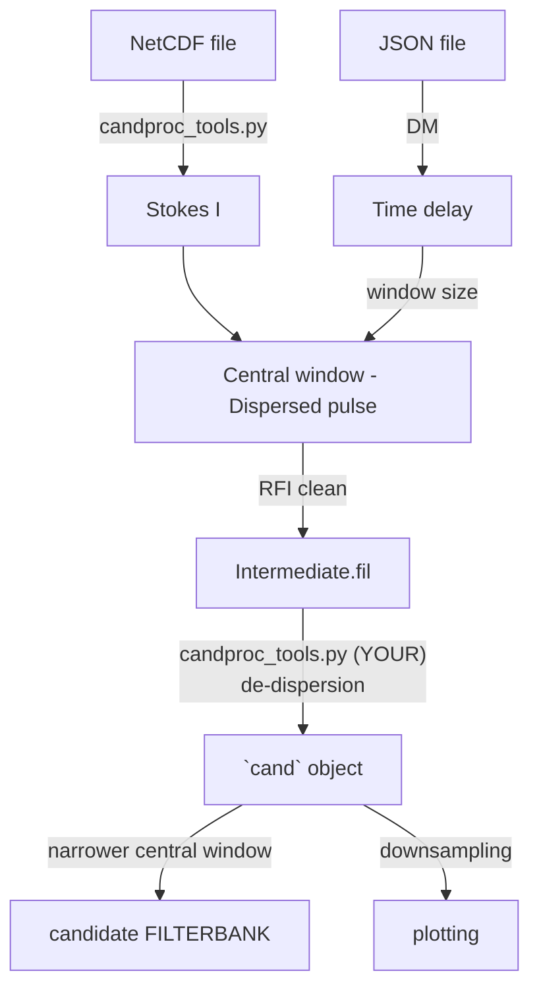

# Usage of T3 plotter

The T3 plotter task includes T3_monitor.py and cand_plotter.py, calling function from candproc_tools.py and analysis_tools.py. 

T3_monitor.py monitors the directory specified by `mon_dir`; whenever a new netcdf file is created, plotting functions in cand_plotter.py are called. The output png files will be posted to the Slack channel #candidates.

To convert this task into a service, place `/GReX-T3/services/cand_plotter.service` in your system directory (`/etc/systemd/system/` for the ovro server for example.) Whenever you make changes to T3_monitor.py or cand_plotter.py, it's recommended to reload the service with 
```linux
sudo systemctl daemon-reload
sudo systemctl restart cand_plotter.service
```
To check status or stop, do
```linux
sudo systemctl status cand_plotter.service
sudo systemctl stop cand_plotter.service
```

Note that we use poetry shell (python environment). In `cand_plotter.service`, you want to check and put the correct python and poetry version in `ExecStart`, `Environment`, and `WorkingDirectory`. 


## Run cand_plotter.py independently

To run cand_plotter.py on a given candidate netcdf file, you want to uncomment line 33 in cand_plotter.py:
```python
js = str(sys.argv[1]) # full .json filename
```
as well as everything after line 328 
```python
if __name__ == '__main__':
    ...
```
(Running T3_monitor.py and the entire service requires these lines to be commented out.)

Typing the following command allows you to generate a .png file in the directory `dir_plot` specified at the beginning of this script. 
```linux
poetry run python cand_plotter.py <full .json name>
```
For example, for candidate `240529aakr`, type `poetry run python cand_plotter.py 240529aakr.json`. 

## What does cand_plotter.py do?



1. read json file
2. calc time delay due to dispersion
3. read in the netcdf file, calc stokes I (candproc_tools.py)
4. select the central time window containing the candidate based on DM
5. RFI clean
6. write the dispersed pulse to an intermediate .fil file
7. read the intermediate.fil into a cand object using Your library (dedispersion)
8. selects the very central window based on ibox
9. write this dedispersed narrow window to the candidate filterbank file
10. downsampling in t, f and dmt space
11. plot the downsampled, dedispersed pulse in this cand object. 
